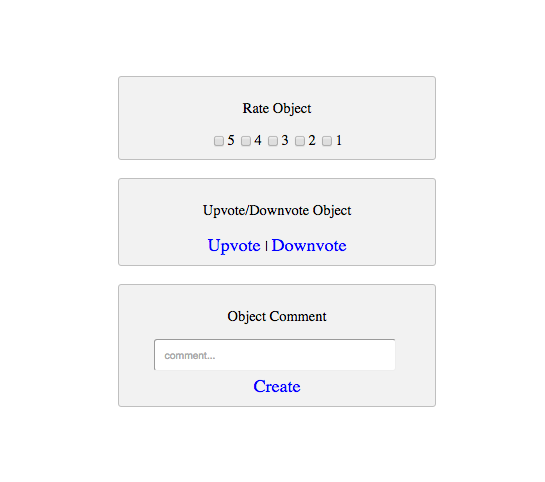

# starterTemplate-Object-Actions-API
a starter template for creating object actions using the Stamplay Rest API

**NOTE: Users must be logged in to use the rate/vote/comment function!**

**CLONING: When cloning this repo, you must initialize your app first to make it work.**

 1) **Initialize the front-end of your app with Stamplay**
 <br>
- Go to your command line and enter **stamplay init**
- When prompted, enter your **appID** & **API Key**

2) **Establish object to be commented on**
- Go to your Stamplay editor and go to the **Data** section. Then go to **Objects**
- Establish which object in the collection your going to comment on by getting it's object **Id**.

3) **Comment**
```
function createObjectComment(){

    var comment = document.getElementById('comment').value;

    var data = JSON.stringify({
        "text": comment
    });

    var xhr = new XMLHttpRequest();
    xhr.withCredentials = true;

    xhr.addEventListener("readystatechange", function () {
        if (this.readyState === this.DONE) {
            console.log(this.responseText);
        }
    });

    xhr.open("PUT", "https://[yourappid].stamplayapp.com/api/cobject/v1/:cobjectId/:id/comment");
    xhr.setRequestHeader("accept", "application/json");
    xhr.setRequestHeader("content-type", "application/json");
    xhr.send(data);
}
```
4) **Establish object to be rated**
- Go to your Stamplay editor and go to the **Data** section. Then go to **Objects**
- Establish which object in the collection your going to rate by getting it's **object Id**.

5) **Rate**
```
function rateFive(){

    var data = JSON.stringify({
        "rate": 5
    });

    var xhr = new XMLHttpRequest();
    xhr.withCredentials = true;

    xhr.addEventListener("readystatechange", function () {
        if (this.readyState === this.DONE) {
            console.log(this.responseText);
        }
    });

    xhr.open("PUT", "https://[yourAppId].stamplayapp.com/api/cobject/v1/cobjectId/:id/rate");
    xhr.setRequestHeader("accept", "application/json");
    xhr.setRequestHeader("content-type", "application/json");

    xhr.send(data);
}
```
6) **Establish object to be voted on**
- Go to your Stamplay editor and go to the **Data** section. Then go to **Objects**
- Establish which object in the collection your going to upvote/downvote by getting it's **object Id**.

7) **Upvote**
```
function upvote(){
    var data = JSON.stringify({
        "type": "upvote"
    });

    var xhr = new XMLHttpRequest();
    xhr.withCredentials = true;

    xhr.addEventListener("readystatechange", function () {
        if (this.readyState === this.DONE) {
            console.log(this.responseText);
        }
    });

    xhr.open("PUT", "https://[yourAppId].stamplayapp.com/api/cobject/v1/:cobjectId/:id/vote");
    xhr.setRequestHeader("accept", "application/json");
    xhr.setRequestHeader("content-type", "application/json");
    xhr.send(data);
}
```
8) **Downvote**
```
function downvote(){
    var data = JSON.stringify({
        "type": "downvote"
    });

    var xhr = new XMLHttpRequest();
    xhr.withCredentials = true;

    xhr.addEventListener("readystatechange", function () {
        if (this.readyState === this.DONE) {
            console.log(this.responseText);
        }
    });

    xhr.open("PUT", "https://[yourAppId].stamplayapp.com/api/cobject/v1/:cobjectId/:id/vote");
    xhr.setRequestHeader("accept", "application/json");
    xhr.setRequestHeader("content-type", "application/json");
    xhr.send(data);
}
```

